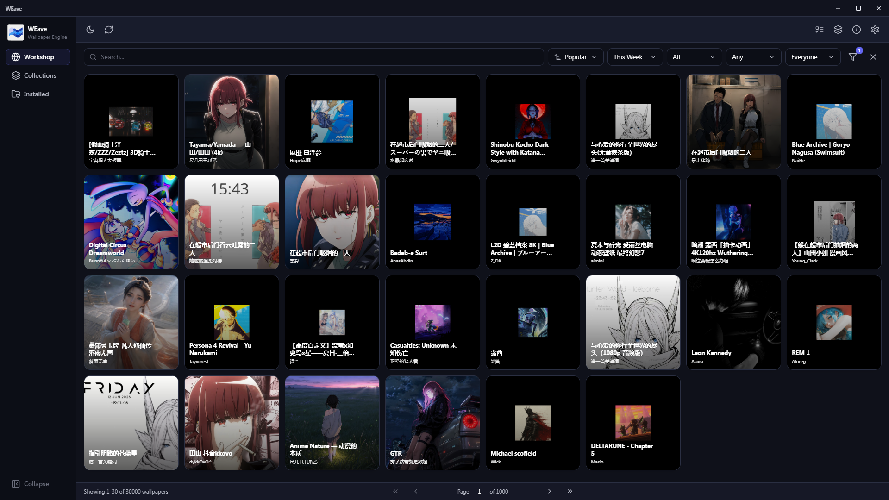

<div align="center">
  
  
  # WEave
  
  **Современное десктопное приложение для управления обоями Steam Workshop для Wallpaper Engine**
  
  [](LICENSE)
  [](https://www.microsoft.com/windows)
  
  [English version](README.md)
</div>

---

## 📖 Обзор

WEave — мощный менеджер Wallpaper Engine Workshop, созданный на Tauri 2 и React. Открывайте, загружайте и управляйте тысячами обоев из Steam Workshop без необходимости открывать Steam или браузер.

<div align="center">
  
</div>

---

## ✨ Основные возможности

<details open>
<summary><b>🌐 Браузер Workshop</b></summary>

- Расширенный поиск с фильтрацией по ключевым словам и диапазону дат
- Сортировка по популярности, трендам или новизне
- Мультикритериальная фильтрация (категория, тип, возрастной рейтинг, разрешение, теги)
- **Трёхстороннее фильтрование** (включить/исключить/игнорировать) для всех типов фильтров
- Превью изображений с ленивой загрузкой и кэшированием
- Детальный просмотр с рейтингами, описаниями и информацией об авторах
- Поддержка коллекций и связанных коллекций
- Предзагрузка страниц для плавной навигации
- Перевод описаний (Google Translate API)

</details>

<details>
<summary><b>📥 Управление загрузками</b></summary>

- Многопоточная загрузка через DepotDownloaderMod
- Поддержка нескольких Steam аккаунтов (6 встроенных + пользовательские)
- Отслеживание прогресса в реальном времени с возможностью отмены
- Пакетная загрузка по ID/URL
- Управление очередью с отслеживанием статусов
- Опциональное автоприменение после загрузки
- **Статус отмены** для прерванных пользователем загрузок

</details>

<details>
<summary><b>🖼️ Установленные обои</b></summary>

- Просмотр всех установленных обоев из Wallpaper Engine
- Локальная фильтрация и сортировка (дата, название, размер, тип)
- **Режим множественного выбора с групповыми операциями** (удаление, извлечение)
- **Фильтр по авторам** с трёхсторонней поддержкой
- Фильтрация по тегам с включением/исключением
- Применение обоев на конкретные мониторы
- Определение активных обоев
- Открытие папок в Проводнике
- Извлечение .pkg файлов с помощью RePKG

</details>

<details>
<summary><b>⚙️ Интеграция с Wallpaper Engine</b></summary>

- Автоопределение установки WE
- Применение обоев на мониторы
- Запуск Wallpaper Engine
- Чтение текущей конфигурации
- Определение активных обоев на всех мониторах

</details>

<details>
<summary><b>🎨 Персонализация</b></summary>

- 5 встроенных тем (Dark, Light, Nord, Monokai, Solarized)
- 10 акцентных цветов
- Поддержка нескольких языков (английский, русский)
- **Типобезопасная TypeScript система i18n**

</details>

<details>
<summary><b>🔧 Дополнительные возможности</b></summary>

- **Автоматическая загрузка .NET Runtime 9** с прогресс-индикатором
- **Диалог лицензионного соглашения** при первом запуске
- **Комплексная система логирования** с ротацией файлов
- **84 комплексных теста** (35 Rust + 49 TypeScript)
- Аутентификация Steam с нативной персистентностью WebView2
- Шифрованное хранилище аккаунтов (PBKDF2 + AES-256-GCM)
- Кэширование метаданных с ручной инициализацией
- Автопроверка обновлений через GitHub releases
- Управление задачами с историей
- Кэширование изображений с LRU
- Запрет множественных экземпляров
- Сохранение геометрии окна

</details>

---

## 🚀 Установка

### Для пользователей

#### Требования
- **Windows 10/11** (x64)
- **Wallpaper Engine** (установлен)
- **.NET Runtime** (загружается автоматически при отсутствии)

#### Шаги

1. Скачайте последний релиз с [**GitHub Releases**](https://github.com/psyattack/weave-tauri/releases)
2. Распакуйте архив
3. Запустите `weave.exe`
4. Примите лицензионное соглашение при первом запуске
5. Если .NET 9 Runtime отсутствует, он будет загружен автоматически

> **Примечание:** WEave автоматически загрузит портативную версию .NET 9.0.17, если в системе не обнаружен .NET 8/9/10.

---

### Для разработчиков

<details>
<summary><b>Настройка для разработки</b></summary>

#### Требования
- [Node.js](https://nodejs.org/) (v18+)
- [Rust](https://www.rust-lang.org/) (v1.77+)
- [.NET 9 Runtime](https://dotnet.microsoft.com/download/dotnet/9.0)
- Wallpaper Engine

#### Настройка

```bash
# Клонировать репозиторий
git clone https://github.com/psyattack/weave-tauri.git
cd weave-tauri

# Скачать необходимые инструменты в папку plugins/:
# - DepotDownloaderMod: https://github.com/mmvanheusden/DepotDownloaderMod/releases
# - RePKG: https://github.com/notscuffed/repkg/releases

# Установить зависимости
npm install

# Запустить в режиме разработки
npm run tauri dev

# Собрать для продакшена
npm run tauri build

# Запустить тесты
npm test  # Тесты frontend
cd src-tauri && cargo test  # Тесты backend
```

</details>

---

## 📚 Использование

1. **Запустите WEave** и примите лицензионное соглашение (при первом запуске)
2. **Настройте** путь к Wallpaper Engine в Настройках (определяется автоматически)
3. **Выберите** Steam аккаунт для загрузок
4. **Просматривайте** вкладку Workshop для поиска обоев
5. **Устанавливайте** обои одним кликом
6. **Управляйте** установленными обоями во вкладке Installed
7. **Применяйте** обои на ваши мониторы

---

## 🛠️ Технологический стек

<table>
<tr>
<td width="50%">

### Frontend
- **React 18** + TypeScript
- **Tauri 2** (Десктопный фреймворк)
- **Vite** (Сборщик)
- **TailwindCSS** (Стилизация)
- **Framer Motion** (Анимации)
- **Radix UI** (Компоненты)
- **Zustand** (Управление состоянием)
- **Type-safe i18n** (Собственная система)
- **Lucide React** (Иконки)
- **Vitest** (Тестирование)

</td>
<td width="50%">

### Backend
- **Rust** (Tauri backend)
- **Tokio** (Асинхронная среда)
- **Reqwest** (HTTP клиент)
- **Scraper** (Парсинг HTML)
- **AES-GCM + PBKDF2** (Шифрование)
- **Serde** (Сериализация)
- **Tracing** (Логирование)

</td>
</tr>
</table>

---

## 📂 Структура проекта

<details>
<summary><b>Просмотр структуры</b></summary>

```
WEave/
├── src/                              # React frontend
│   ├── components/
│   │   ├── common/                   # Переиспользуемые UI (Dialog, Drawer, Tooltip и др.)
│   │   ├── dialogs/                  # Модальные окна (Settings, Legal, Update и др.)
│   │   ├── installed/                # Компоненты установленных обоев
│   │   ├── layout/                   # TitleBar, Sidebar, TopBar
│   │   ├── settings/                 # Секции диалога настроек
│   │   ├── tasks/                    # Панель задач загрузки/извлечения
│   │   ├── views/                    # Основные представления (Workshop, Collections, Installed)
│   │   └── workshop/                 # Компоненты Workshop (Cards, Filters, Details)
│   ├── stores/                       # Zustand хранилища состояний
│   ├── hooks/                        # React хуки (useBootstrap, useTheme и др.)
│   ├── lib/                          # Утилиты (errors, logger, helpers)
│   ├── i18n/                         # Типобезопасная система i18n
│   ├── types/                        # TypeScript определения типов
│   └── assets/                       # Статические ресурсы
│
├── src-tauri/                        # Rust backend
│   ├── src/
│   │   ├── commands/                 # Обработчики Tauri команд
│   │   │   ├── accounts.rs           # Управление аккаунтами
│   │   │   ├── download.rs           # Оркестрация загрузок
│   │   │   ├── extract.rs            # Извлечение пакетов
│   │   │   ├── steam.rs              # Steam логин/cookies
│   │   │   ├── dotnet.rs             # Управление .NET runtime
│   │   │   ├── logging.rs            # Интеграция логирования
│   │   │   └── ...
│   │   ├── workshop/                 # Парсер Steam Workshop
│   │   ├── accounts/                 # Шифрованное хранилище аккаунтов
│   │   ├── config/                   # Управление конфигурацией
│   │   ├── download/                 # Менеджер загрузок (обёртка DepotDownloader)
│   │   ├── extract/                  # Менеджер извлечения (обёртка RePKG)
│   │   ├── dotnet_runtime/           # Загрузчик .NET runtime
│   │   ├── we_client/                # Клиент Wallpaper Engine
│   │   ├── metadata/                 # Инициализатор пакетных метаданных
│   │   ├── logger.rs                 # Ротирующий файловый логгер
│   │   ├── errors.rs                 # Структурированные типы ошибок
│   │   └── ...
│   └── locales/                      # Переводы backend
│
└── plugins/                          # Внешние инструменты (gitignored)
    ├── DepotDownloaderMod/           # Загрузчик Steam депо (.NET)
    ├── RePKG/                        # Распаковщик пакетов WE
    └── dotnet/                       # Портативный .NET runtime (автозагрузка)
```

</details>

---

## 📝 Конфигурация

Файлы конфигурации хранятся в:  
**`%LOCALAPPDATA%\com.weave.app\`**

| Файл | Описание |
|------|----------|
| `settings.json` | Настройки приложения (тема, язык, директория WE и др.) |
| `metadata.json` | Кэшированные метаданные обоев |
| `user_accounts.enc` | Зашифрованные Steam аккаунты |
| `SteamWebView/` | Данные WebView2 (сохранённые cookies) |
| `weave.log` | Ротирующий лог-файл (10MB, 5 файлов) |

---

## 🤝 Участие в разработке

Приветствуются любые вклады! Не стесняйтесь отправлять Pull Request.

---

## 📄 Лицензия

Этот проект лицензирован под [MIT License](LICENSE).

---

## 🙏 Благодарности

- **Создано с помощью:** [Tauri](https://tauri.app/), [React](https://react.dev/)
- **Иконки:** [Lucide](https://lucide.dev/)
- **UI компоненты:** [Radix UI](https://www.radix-ui.com/)
- **Инструмент загрузки:** [DepotDownloaderMod](https://github.com/SteamAutoCracks/DepotDownloaderMod)
- **Распаковщик пакетов:** [RePKG](https://github.com/notscuffed/repkg)

---

## ⚠️ Отказ от ответственности

Это приложение **не связано и не одобрено** Valve Corporation или Wallpaper Engine. Steam и Wallpaper Engine являются торговыми марками их соответствующих владельцев.

---

## 💬 Поддержка

По вопросам, проблемам или запросам функций открывайте issue на [**GitHub**](https://github.com/psyattack/weave-tauri/issues).

---